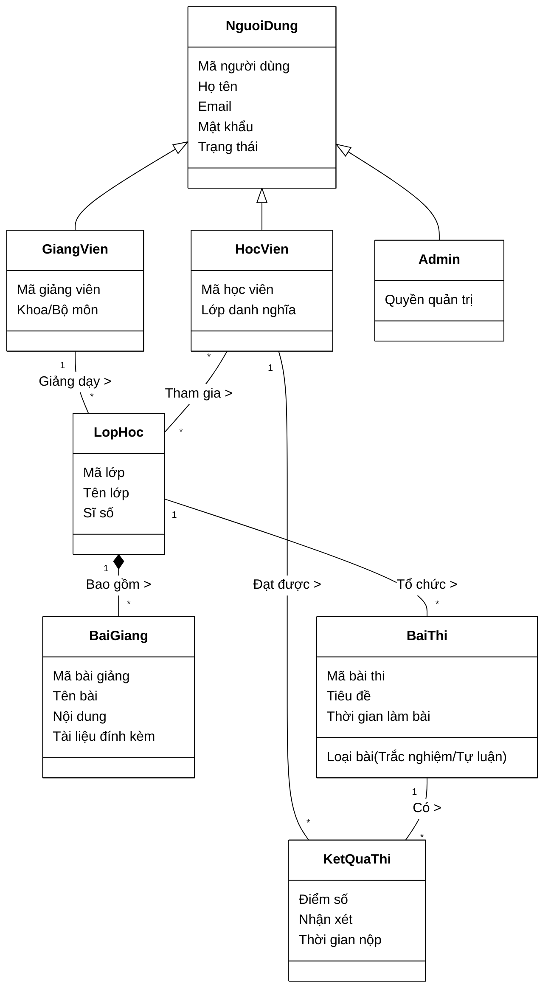

```mermaid
%%{init: { 'theme': 'base', 'themeVariables': { 'primaryColor': '#ffffff', 'primaryBorderColor': '#000000', 'lineColor': '#000000', 'textColor': '#000000', 'actorBkg': '#ffffff', 'actorBorder': '#000000', 'signalColor': '#000000', 'signalTextColor': '#000000', 'activationBorderColor': '#000000', 'activationBkgColor': '#e0e0e0', 'noteBkgColor': '#ffffff', 'noteBorderColor': '#000000' } } }%%
classDiagram
    %% Khai báo các thực thể
    class NguoiDung {
        Mã người dùng
        Họ tên
        Email
        Mật khẩu
        Trạng thái
    }
    class HocVien {
        Mã học viên
        Lớp danh nghĩa
    }
    class GiangVien {
        Mã giảng viên
        Khoa/Bộ môn
    }
    class Admin {
        Quyền quản trị
    }
    class LopHoc {
        Mã lớp
        Tên lớp
        Sĩ số
    }
    class BaiGiang {
        Mã bài giảng
        Tên bài
        Nội dung
        Tài liệu đính kèm
    }
    class BaiThi {
        Mã bài thi
        Tiêu đề
        Thời gian làm bài
        Loại bài (Trắc nghiệm/Tự luận)
    }
    class KetQuaThi {
        Điểm số
        Nhận xét
        Thời gian nộp
    }

    %% Mối quan hệ Kế thừa
    NguoiDung <|-- HocVien
    NguoiDung <|-- GiangVien
    NguoiDung <|-- Admin

    %% Mối quan hệ Kết hợp
    GiangVien "1" -- "*" LopHoc : Giảng dạy >
    HocVien "*" -- "*" LopHoc : Tham gia >
    LopHoc "1" *-- "*" BaiGiang : Bao gồm >
    LopHoc "1" -- "*" BaiThi : Tổ chức >
    HocVien "1" -- "*" KetQuaThi : Đạt được >
    BaiThi "1" -- "*" KetQuaThi : Có >
```
