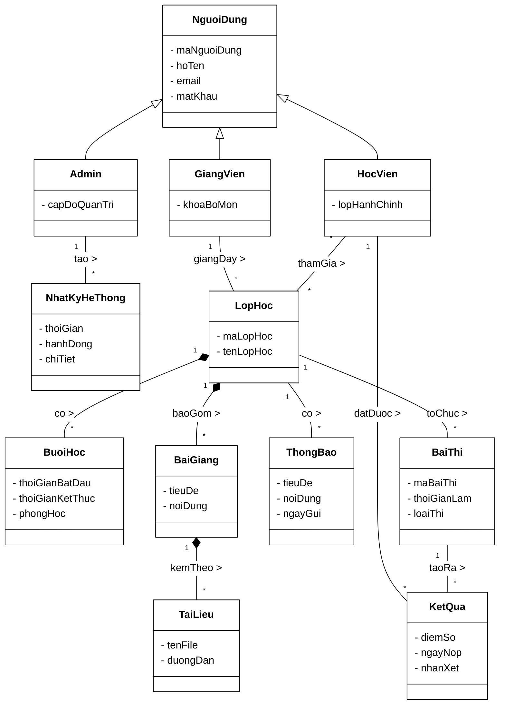

```mermaid
%%{init: { 'theme': 'base', 'themeVariables': { 'primaryColor': '#ffffff', 'primaryBorderColor': '#000000', 'lineColor': '#000000', 'textColor': '#000000', 'actorBkg': '#ffffff', 'actorBorder': '#000000', 'actorLineColor': '#cccccc', 'signalColor': '#000000', 'signalTextColor': '#000000', 'activationBorderColor': '#000000', 'activationBkgColor': '#e0e0e0', 'noteBkgColor': '#ffffff', 'noteBorderColor': '#000000' } } }%%
classDiagram
    %% --- NHÓM NGƯỜI DÙNG ---
    class NguoiDung {
        - maNguoiDung
        - hoTen
        - email
        - matKhau
    }
    class HocVien {
        - lopHanhChinh
    }
    class GiangVien {
        - khoaBoMon
    }
    class Admin {
        - capDoQuanTri
    }
    class NhatKyHeThong {
        - thoiGian
        - hanhDong
        - chiTiet
    }

    %% --- NHÓM TỔ CHỨC ĐÀO TẠO ---
    class LopHoc {
        - maLopHoc
        - tenLopHoc
    }
    class BuoiHoc {
        - thoiGianBatDau
        - thoiGianKetThuc
        - phongHoc
    }
    class BaiGiang {
        - tieuDe
        - noiDung
    }
    class TaiLieu {
        - tenFile
        - duongDan
    }
    class ThongBao {
        - tieuDe
        - noiDung
        - ngayGui
    }

    %% --- NHÓM ĐÁNH GIÁ & THI CỬ ---
    class BaiThi {
        - maBaiThi
        - thoiGianLam
        - loaiThi
    }
    class KetQua {
        - diemSo
        - ngayNop
        - nhanXet
    }

    %% --- CÁC MỐI QUAN HỆ ---
    NguoiDung <|-- HocVien
    NguoiDung <|-- GiangVien
    NguoiDung <|-- Admin
    
    Admin "1" -- "*" NhatKyHeThong : tao >

    GiangVien "1" -- "*" LopHoc : giangDay >
    HocVien "*" -- "*" LopHoc : thamGia >
    
    LopHoc "1" *-- "*" BuoiHoc : co >
    LopHoc "1" *-- "*" BaiGiang : baoGom >
    LopHoc "1" -- "*" BaiThi : toChuc >
    LopHoc "1" -- "*" ThongBao : co >

    BaiGiang "1" *-- "*" TaiLieu : kemTheo >
    
    HocVien "1" -- "*" KetQua : datDuoc >
    BaiThi "1" -- "*" KetQua : taoRa >
```
