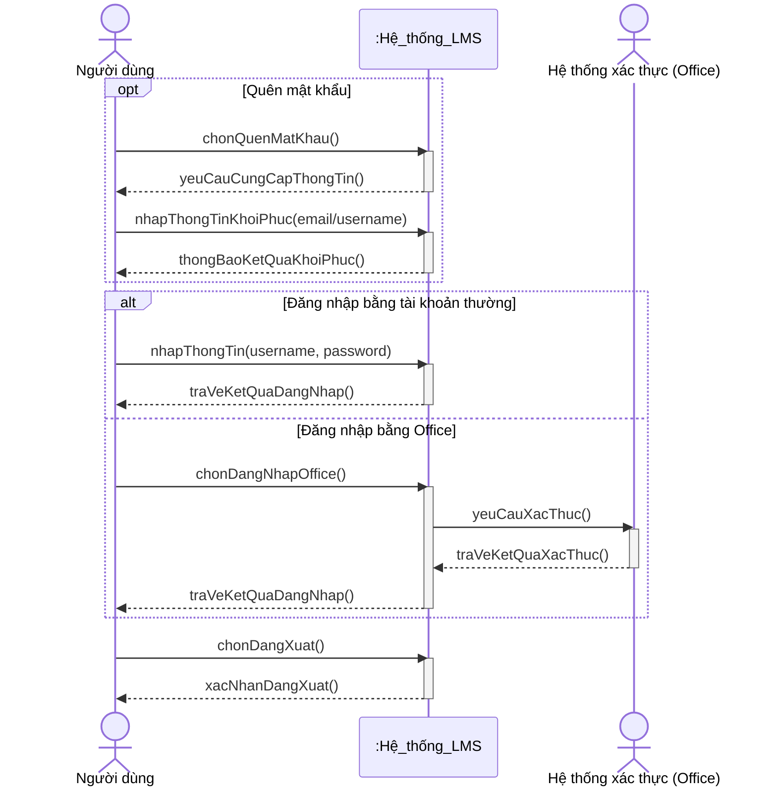

```mermaid
sequenceDiagram
    actor U as Người dùng
    participant Sys as :Hệ_thống_LMS
    actor Auth as Hệ thống xác thực (Office)

    %% Khung tùy chọn: Quên mật khẩu
    opt Quên mật khẩu
        U->>Sys: chonQuenMatKhau()
        activate Sys
        Sys-->>U: yeuCauCungCapThongTin()
        deactivate Sys
        
        U->>Sys: nhapThongTinKhoiPhuc(email/username)
        activate Sys
        Sys-->>U: thongBaoKetQuaKhoiPhuc()
        deactivate Sys
    end

    %% Khung lựa chọn phương thức đăng nhập
    alt Đăng nhập bằng tài khoản thường
        U->>Sys: nhapThongTin(username, password)
        activate Sys
        Sys-->>U: traVeKetQuaDangNhap()
        deactivate Sys

    else Đăng nhập bằng Office
        U->>Sys: chonDangNhapOffice()
        activate Sys
        Sys->>Auth: yeuCauXacThuc()
        activate Auth
        Auth-->>Sys: traVeKetQuaXacThuc()
        deactivate Auth
        Sys-->>U: traVeKetQuaDangNhap()
        deactivate Sys
    end

    %% Luồng Đăng xuất
    U->>Sys: chonDangXuat()
    activate Sys
    Sys-->>U: xacNhanDangXuat()
    deactivate Sys
```
