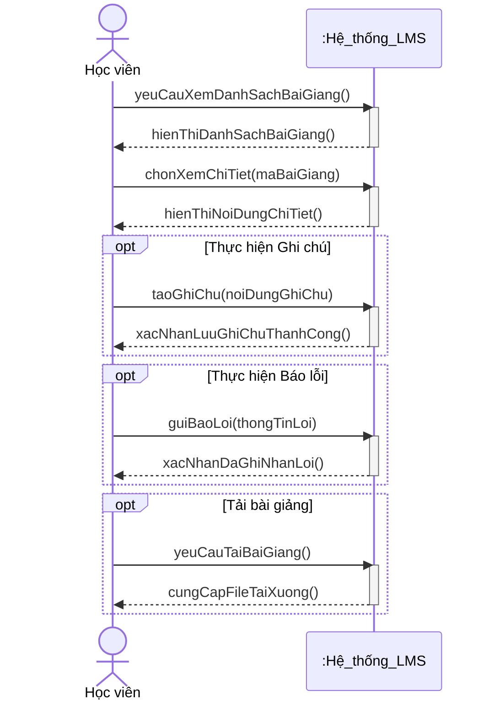

```mermaid
sequenceDiagram
    actor HV as Học viên
    participant Sys as :Hệ_thống_LMS

    %% Luồng cơ bản: Xem danh sách bài giảng
    HV->>Sys: yeuCauXemDanhSachBaiGiang()
    activate Sys
    Sys-->>HV: hienThiDanhSachBaiGiang()
    deactivate Sys

    %% Luồng cơ bản (Include): Xem chi tiết bài giảng
    HV->>Sys: chonXemChiTiet(maBaiGiang)
    activate Sys
    Sys-->>HV: hienThiNoiDungChiTiet()
    deactivate Sys

    %% Các luồng mở rộng (Extend)
    %% Khung tùy chọn 1: Ghi chú
    opt Thực hiện Ghi chú
        HV->>Sys: taoGhiChu(noiDungGhiChu)
        activate Sys
        Sys-->>HV: xacNhanLuuGhiChuThanhCong()
        deactivate Sys
    end

    %% Khung tùy chọn 2: Báo lỗi
    opt Thực hiện Báo lỗi
        HV->>Sys: guiBaoLoi(thongTinLoi)
        activate Sys
        Sys-->>HV: xacNhanDaGhiNhanLoi()
        deactivate Sys
    end

    %% Khung tùy chọn 3: Tải bài giảng
    opt Tải bài giảng
        HV->>Sys: yeuCauTaiBaiGiang()
        activate Sys
        Sys-->>HV: cungCapFileTaiXuong()
        deactivate Sys
    end
```
