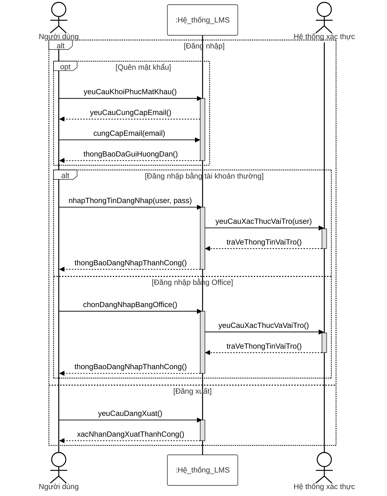

```mermaid
%%{init: { 'theme': 'base', 'themeVariables': { 'primaryColor': '#ffffff', 'primaryBorderColor': '#000000', 'lineColor': '#000000', 'textColor': '#000000', 'actorBkg': '#ffffff', 'actorBorder': '#000000', 'signalColor': '#000000', 'signalTextColor': '#000000', 'activationBorderColor': '#000000', 'activationBkgColor': '#e0e0e0', 'noteBkgColor': '#ffffff', 'noteBorderColor': '#000000' } } }%%
sequenceDiagram
    actor ND as Người dùng
    participant Sys as :Hệ_thống_LMS
    actor HT as Hệ thống xác thực

    alt Đăng nhập
        %% Luồng mở rộng (Extend): Quên mật khẩu
        opt Quên mật khẩu
            ND->>Sys: yeuCauKhoiPhucMatKhau()
            activate Sys
            Sys-->>ND: yeuCauCungCapEmail()
            ND->>Sys: cungCapEmail(email)
            Sys-->>ND: thongBaoDaGuiHuongDan()
            deactivate Sys
        end

        %% Lựa chọn phương thức đăng nhập (Kế thừa Use Case Đăng nhập)
        alt Đăng nhập bằng tài khoản thường
            ND->>Sys: nhapThongTinDangNhap(user, pass)
            activate Sys
            
            %% Luồng bắt buộc (Include): Xác thực vai trò
            Sys->>HT: yeuCauXacThucVaiTro(user)
            activate HT
            HT-->>Sys: traVeThongTinVaiTro()
            deactivate HT
            
            Sys-->>ND: thongBaoDangNhapThanhCong()
            deactivate Sys

        else Đăng nhập bằng Office
            ND->>Sys: chonDangNhapBangOffice()
            activate Sys
            
            %% Luồng bắt buộc (Include): Xác thực vai trò
            Sys->>HT: yeuCauXacThucVaVaiTro()
            activate HT
            HT-->>Sys: traVeThongTinVaiTro()
            deactivate HT
            
            Sys-->>ND: thongBaoDangNhapThanhCong()
            deactivate Sys
        end

    else Đăng xuất
        ND->>Sys: yeuCauDangXuat()
        activate Sys
        Sys-->>ND: xacNhanDangXuatThanhCong()
        deactivate Sys
    end
```
