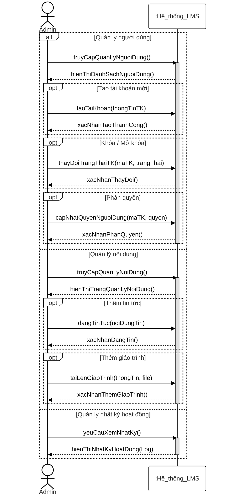

```mermaid
%%{init: { 'theme': 'base', 'themeVariables': { 'primaryColor': '#ffffff', 'primaryBorderColor': '#000000', 'lineColor': '#000000', 'textColor': '#000000', 'actorBkg': '#ffffff', 'actorBorder': '#000000', 'signalColor': '#000000', 'signalTextColor': '#000000', 'activationBorderColor': '#000000', 'activationBkgColor': '#e0e0e0', 'noteBkgColor': '#ffffff', 'noteBorderColor': '#000000' } } }%%
sequenceDiagram
    actor Ad as Admin
    participant Sys as :Hệ_thống_LMS

    alt Quản lý người dùng
        Ad->>Sys: truyCapQuanLyNguoiDung()
        activate Sys
        Sys-->>Ad: hienThiDanhSachNguoiDung()
        
        opt Tạo tài khoản mới
            Ad->>Sys: taoTaiKhoan(thongTinTK)
            Sys-->>Ad: xacNhanTaoThanhCong()
        end
        
        opt Khóa / Mở khóa
            Ad->>Sys: thayDoiTrangThaiTK(maTK, trangThai)
            Sys-->>Ad: xacNhanThayDoi()
        end
        
        opt Phân quyền
            Ad->>Sys: capNhatQuyenNguoiDung(maTK, quyen)
            Sys-->>Ad: xacNhanPhanQuyen()
        end
        deactivate Sys

    else Quản lý nội dung
        Ad->>Sys: truyCapQuanLyNoiDung()
        activate Sys
        Sys-->>Ad: hienThiTrangQuanLyNoiDung()
        
        opt Thêm tin tức
            Ad->>Sys: dangTinTuc(noiDungTin)
            Sys-->>Ad: xacNhanDangTin()
        end
        
        opt Thêm giáo trình
            Ad->>Sys: taiLenGiaoTrinh(thongTin, file)
            Sys-->>Ad: xacNhanThemGiaoTrinh()
        end
        deactivate Sys
        
    else Quản lý nhật ký hoạt động
        Ad->>Sys: yeuCauXemNhatKy()
        activate Sys
        Sys-->>Ad: hienThiNhatKyHoatDong(Log)
        deactivate Sys
    end
```
