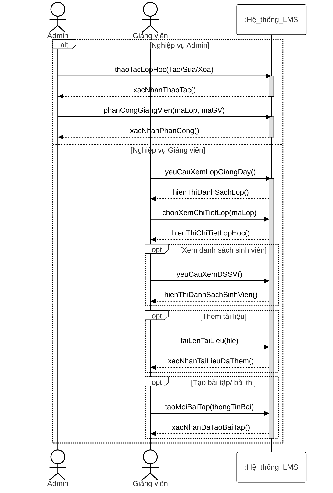

```mermaid
%%{init: { 'theme': 'base', 'themeVariables': { 'primaryColor': '#ffffff', 'primaryBorderColor': '#000000', 'lineColor': '#000000', 'textColor': '#000000', 'actorBkg': '#ffffff', 'actorBorder': '#000000', 'signalColor': '#000000', 'signalTextColor': '#000000', 'activationBorderColor': '#000000', 'activationBkgColor': '#e0e0e0', 'noteBkgColor': '#ffffff', 'noteBorderColor': '#000000' } } }%%
sequenceDiagram
    actor Ad as Admin
    actor GV as Giảng viên
    participant Sys as :Hệ_thống_LMS

    alt Nghiệp vụ Admin
        Ad->>Sys: thaoTacLopHoc(Tao/Sua/Xoa)
        activate Sys
        Sys-->>Ad: xacNhanThaoTac()
        deactivate Sys
        
        Ad->>Sys: phanCongGiangVien(maLop, maGV)
        activate Sys
        Sys-->>Ad: xacNhanPhanCong()
        deactivate Sys

    else Nghiệp vụ Giảng viên
        GV->>Sys: yeuCauXemLopGiangDay()
        activate Sys
        Sys-->>GV: hienThiDanhSachLop()
        
        %% Bao gồm (Include) việc xem chi tiết
        GV->>Sys: chonXemChiTietLop(maLop)
        Sys-->>GV: hienThiChiTietLopHoc()
        
        %% Các luồng mở rộng (Extend) từ Chi tiết lớp học
        opt Xem danh sách sinh viên
            GV->>Sys: yeuCauXemDSSV()
            Sys-->>GV: hienThiDanhSachSinhVien()
        end
        
        opt Thêm tài liệu
            GV->>Sys: taiLenTaiLieu(file)
            Sys-->>GV: xacNhanTaiLieuDaThem()
        end
        
        opt Tạo bài tập/ bài thi
            GV->>Sys: taoMoiBaiTap(thongTinBai)
            Sys-->>GV: xacNhanDaTaoBaiTap()
        end
        deactivate Sys
    end
```
