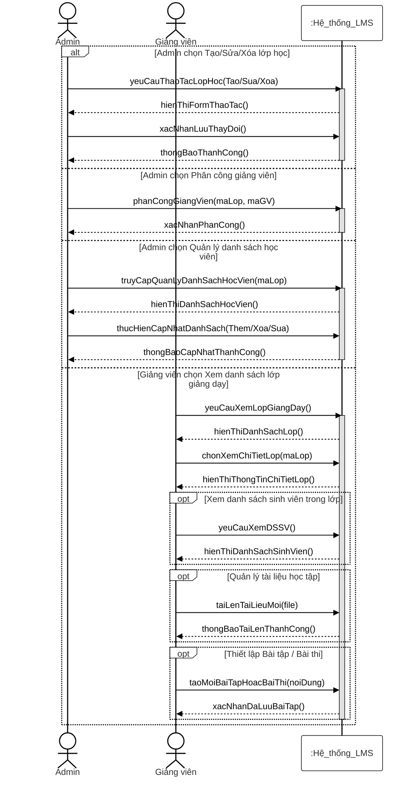

```mermaid
%%{init: { 'theme': 'base', 'themeVariables': { 'primaryColor': '#ffffff', 'primaryBorderColor': '#000000', 'lineColor': '#000000', 'textColor': '#000000', 'actorBkg': '#ffffff', 'actorBorder': '#000000', 'signalColor': '#000000', 'signalTextColor': '#000000', 'activationBorderColor': '#000000', 'activationBkgColor': '#e0e0e0', 'noteBkgColor': '#ffffff', 'noteBorderColor': '#000000' } } }%%
sequenceDiagram
    actor Ad as Admin
    actor GV as Giảng viên
    participant Sys as :Hệ_thống_LMS

    alt Admin chọn Tạo/Sửa/Xóa lớp học
        Ad->>Sys: yeuCauThaoTacLopHoc(Tao/Sua/Xoa)
        activate Sys
        Sys-->>Ad: hienThiFormThaoTac()
        Ad->>Sys: xacNhanLuuThayDoi()
        Sys-->>Ad: thongBaoThanhCong()
        deactivate Sys

    else Admin chọn Phân công giảng viên
        Ad->>Sys: phanCongGiangVien(maLop, maGV)
        activate Sys
        Sys-->>Ad: xacNhanPhanCong()
        deactivate Sys

    else Admin chọn Quản lý danh sách học viên
        Ad->>Sys: truyCapQuanLyDanhSachHocVien(maLop)
        activate Sys
        Sys-->>Ad: hienThiDanhSachHocVien()
        Ad->>Sys: thucHienCapNhatDanhSach(Them/Xoa/Sua)
        Sys-->>Ad: thongBaoCapNhatThanhCong()
        deactivate Sys

    else Giảng viên chọn Xem danh sách lớp giảng dạy
        GV->>Sys: yeuCauXemLopGiangDay()
        activate Sys
        Sys-->>GV: hienThiDanhSachLop()
        
        %% Include: Chi tiết lớp học
        GV->>Sys: chonXemChiTietLop(maLop)
        Sys-->>GV: hienThiThongTinChiTietLop()
        
        %% Các chức năng mở rộng (Extend)
        opt Xem danh sách sinh viên trong lớp
            GV->>Sys: yeuCauXemDSSV()
            Sys-->>GV: hienThiDanhSachSinhVien()
        end
        
        opt Quản lý tài liệu học tập
            GV->>Sys: taiLenTaiLieuMoi(file)
            Sys-->>GV: thongBaoTaiLenThanhCong()
        end
        
        opt Thiết lập Bài tập / Bài thi
            GV->>Sys: taoMoiBaiTapHoacBaiThi(noiDung)
            Sys-->>GV: xacNhanDaLuuBaiTap()
        end
        deactivate Sys
    end
```
