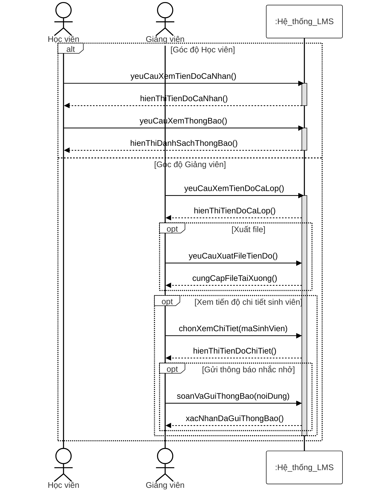

```mermaid
%%{init: { 'theme': 'base', 'themeVariables': { 'primaryColor': '#ffffff', 'primaryBorderColor': '#000000', 'lineColor': '#000000', 'textColor': '#000000', 'actorBkg': '#ffffff', 'actorBorder': '#000000', 'signalColor': '#000000', 'signalTextColor': '#000000', 'activationBorderColor': '#000000', 'activationBkgColor': '#e0e0e0', 'noteBkgColor': '#ffffff', 'noteBorderColor': '#000000' } } }%%
sequenceDiagram
    actor HV as Học viên
    actor GV as Giảng viên
    participant Sys as :Hệ_thống_LMS

    %% Luồng của Học viên
    alt Góc độ Học viên
        HV->>Sys: yeuCauXemTienDoCaNhan()
        activate Sys
        Sys-->>HV: hienThiTienDoCaNhan()
        deactivate Sys
        
        HV->>Sys: yeuCauXemThongBao()
        activate Sys
        Sys-->>HV: hienThiDanhSachThongBao()
        deactivate Sys

    %% Luồng của Giảng viên
    else Góc độ Giảng viên
        GV->>Sys: yeuCauXemTienDoCaLop()
        activate Sys
        Sys-->>GV: hienThiTienDoCaLop()
        
        opt Xuất file
            GV->>Sys: yeuCauXuatFileTienDo()
            Sys-->>GV: cungCapFileTaiXuong()
        end

        opt Xem tiến độ chi tiết sinh viên
            GV->>Sys: chonXemChiTiet(maSinhVien)
            Sys-->>GV: hienThiTienDoChiTiet()
            
            opt Gửi thông báo nhắc nhở
                GV->>Sys: soanVaGuiThongBao(noiDung)
                Sys-->>GV: xacNhanDaGuiThongBao()
            end
        end
        deactivate Sys
    end
```
