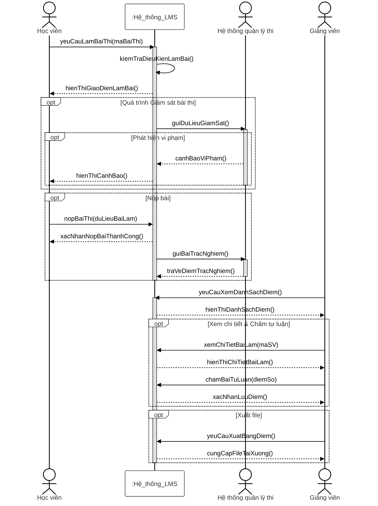

```mermaid
%%{init: { 'theme': 'base', 'themeVariables': { 'primaryColor': '#ffffff', 'primaryBorderColor': '#000000', 'lineColor': '#000000', 'textColor': '#000000', 'actorBkg': '#ffffff', 'actorBorder': '#000000', 'signalColor': '#000000', 'signalTextColor': '#000000', 'activationBorderColor': '#000000', 'activationBkgColor': '#e0e0e0', 'noteBkgColor': '#ffffff', 'noteBorderColor': '#000000' } } }%%
sequenceDiagram
    actor HV as Học viên
    participant Sys as :Hệ_thống_LMS
    actor HT as Hệ thống quản lý thi
    actor GV as Giảng viên

    %% Luồng Học viên làm bài thi
    HV->>Sys: yeuCauLamBaiThi(maBaiThi)
    activate Sys
    %% Include: Kiểm tra điều kiện
    Sys->>Sys: kiemTraDieuKienLamBai()
    Sys-->>HV: hienThiGiaoDienLamBai()
    
    %% Extend: Giám sát
    opt Quá trình Giám sát bài thi
        Sys->>HT: guiDuLieuGiamSat()
        activate HT
        opt Phát hiện vi phạm
            HT-->>Sys: canhBaoViPham()
            Sys-->>HV: hienThiCanhBao()
        end
        deactivate HT
    end

    %% Extend: Nộp bài
    opt Nộp bài
        HV->>Sys: nopBaiThi(duLieuBaiLam)
        Sys-->>HV: xacNhanNopBaiThanhCong()
        %% Extend: Chấm trắc nghiệm tự động
        Sys->>HT: guiBaiTracNghiem()
        activate HT
        HT-->>Sys: traVeDiemTracNghiem()
        deactivate HT
    end
    deactivate Sys

    %% Luồng Giảng viên thao tác
    GV->>Sys: yeuCauXemDanhSachDiem()
    activate Sys
    Sys-->>GV: hienThiDanhSachDiem()
    
    opt Xem chi tiết & Chấm tự luận
        GV->>Sys: xemChiTietBaiLam(maSV)
        Sys-->>GV: hienThiChiTietBaiLam()
        GV->>Sys: chamBaiTuLuan(diemSo)
        Sys-->>GV: xacNhanLuuDiem()
    end
    
    opt Xuất file
        GV->>Sys: yeuCauXuatBangDiem()
        Sys-->>GV: cungCapFileTaiXuong()
    end
    deactivate Sys
```
