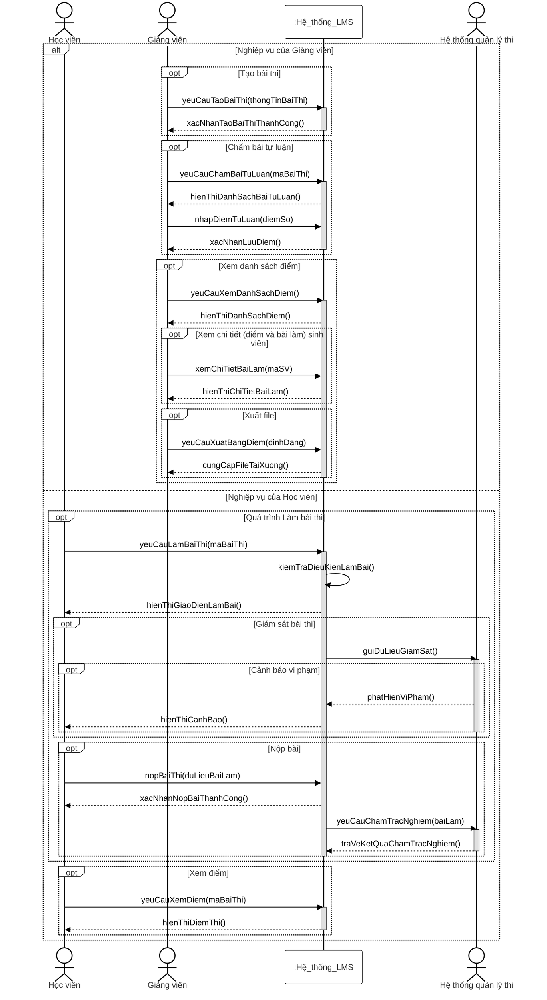

```mermaid
%%{init: { 'theme': 'base', 'themeVariables': { 'primaryColor': '#ffffff', 'primaryBorderColor': '#000000', 'lineColor': '#000000', 'textColor': '#000000', 'actorBkg': '#ffffff', 'actorBorder': '#000000', 'signalColor': '#000000', 'signalTextColor': '#000000', 'activationBorderColor': '#000000', 'activationBkgColor': '#e0e0e0', 'noteBkgColor': '#ffffff', 'noteBorderColor': '#000000' } } }%%
sequenceDiagram
    actor HV as Học viên
    actor GV as Giảng viên
    participant Sys as :Hệ_thống_LMS
    actor HT as Hệ thống quản lý thi

    %% Khối nghiệp vụ của Giảng viên
    alt Nghiệp vụ của Giảng viên
        opt Tạo bài thi
            GV->>Sys: yeuCauTaoBaiThi(thongTinBaiThi)
            activate Sys
            Sys-->>GV: xacNhanTaoBaiThiThanhCong()
            deactivate Sys
        end

        opt Chấm bài tự luận
            GV->>Sys: yeuCauChamBaiTuLuan(maBaiThi)
            activate Sys
            Sys-->>GV: hienThiDanhSachBaiTuLuan()
            GV->>Sys: nhapDiemTuLuan(diemSo)
            Sys-->>GV: xacNhanLuuDiem()
            deactivate Sys
        end

        opt Xem danh sách điểm
            GV->>Sys: yeuCauXemDanhSachDiem()
            activate Sys
            Sys-->>GV: hienThiDanhSachDiem()

            %% Các luồng Extend của Xem danh sách điểm
            opt Xem chi tiết (điểm và bài làm) sinh viên
                GV->>Sys: xemChiTietBaiLam(maSV)
                Sys-->>GV: hienThiChiTietBaiLam()
            end

            opt Xuất file
                GV->>Sys: yeuCauXuatBangDiem(dinhDang)
                Sys-->>GV: cungCapFileTaiXuong()
            end
            deactivate Sys
        end

    %% Khối nghiệp vụ của Học viên
    else Nghiệp vụ của Học viên
        opt Quá trình Làm bài thi
            HV->>Sys: yeuCauLamBaiThi(maBaiThi)
            activate Sys
            
            %% Include: Kiểm tra điều kiện làm bài
            Sys->>Sys: kiemTraDieuKienLamBai()
            Sys-->>HV: hienThiGiaoDienLamBai()
            
            %% Extend: Giám sát bài thi
            opt Giám sát bài thi
                Sys->>HT: guiDuLieuGiamSat()
                activate HT
                
                %% Extend từ Giám sát: Cảnh báo vi phạm
                opt Cảnh báo vi phạm
                    HT-->>Sys: phatHienViPham()
                    Sys-->>HV: hienThiCanhBao()
                end
                deactivate HT
            end

            %% Extend: Nộp bài
            opt Nộp bài
                HV->>Sys: nopBaiThi(duLieuBaiLam)
                Sys-->>HV: xacNhanNopBaiThanhCong()
                
                %% Extend từ Nộp bài: Chấm bài trắc nghiệm
                Sys->>HT: yeuCauChamTracNghiem(baiLam)
                activate HT
                HT-->>Sys: traVeKetQuaChamTracNghiem()
                deactivate HT
            end
            deactivate Sys
        end

        opt Xem điểm
            HV->>Sys: yeuCauXemDiem(maBaiThi)
            activate Sys
            Sys-->>HV: hienThiDiemThi()
            deactivate Sys
        end
    end
```
