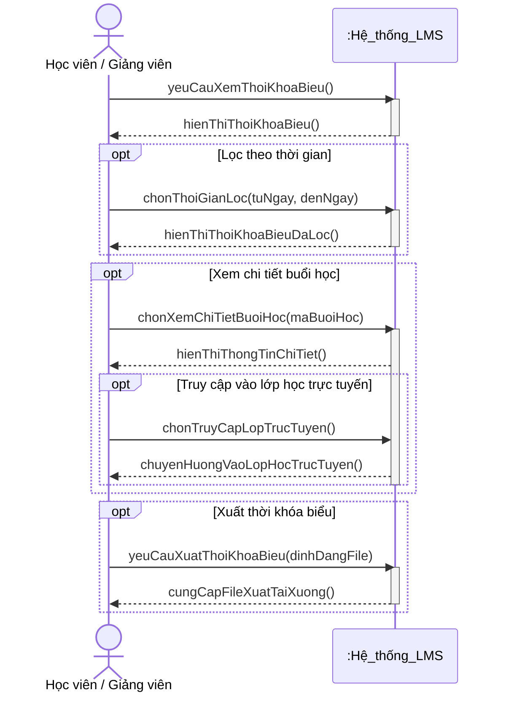

```mermaid
sequenceDiagram
    actor ND as Học viên / Giảng viên
    participant Sys as :Hệ_thống_LMS

    %% Luồng cơ bản: Xem thời khóa biểu
    ND->>Sys: yeuCauXemThoiKhoaBieu()
    activate Sys
    Sys-->>ND: hienThiThoiKhoaBieu()
    deactivate Sys

    %% Các luồng mở rộng (Extend)
    
    %% Khung tùy chọn 1: Lọc theo thời gian
    opt Lọc theo thời gian
        ND->>Sys: chonThoiGianLoc(tuNgay, denNgay)
        activate Sys
        Sys-->>ND: hienThiThoiKhoaBieuDaLoc()
        deactivate Sys
    end

    %% Khung tùy chọn 2: Xem chi tiết buổi học và Truy cập lớp trực tuyến
    opt Xem chi tiết buổi học
        ND->>Sys: chonXemChiTietBuoiHoc(maBuoiHoc)
        activate Sys
        Sys-->>ND: hienThiThongTinChiTiet()
        
        %% Khung tùy chọn con: Truy cập lớp trực tuyến (Extend của Xem chi tiết)
        opt Truy cập vào lớp học trực tuyến
            ND->>Sys: chonTruyCapLopTrucTuyen()
            Sys-->>ND: chuyenHuongVaoLopHocTrucTuyen()
        end
        
        deactivate Sys
    end

    %% Khung tùy chọn 3: Xuất thời khóa biểu
    opt Xuất thời khóa biểu
        ND->>Sys: yeuCauXuatThoiKhoaBieu(dinhDangFile)
        activate Sys
        Sys-->>ND: cungCapFileXuatTaiXuong()
        deactivate Sys
    end
```
