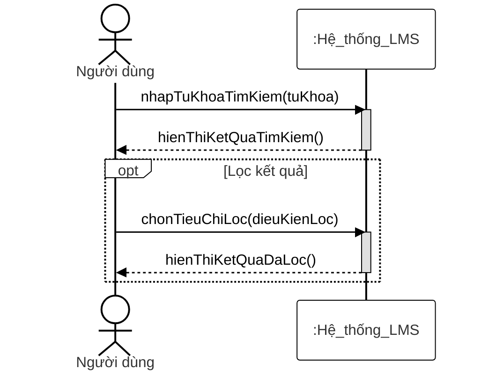

```mermaid
%% Cấu hình ép buộc màu đen trắng
%%{init: { 'theme': 'base', 'themeVariables': { 'primaryColor': '#ffffff', 'primaryBorderColor': '#000000', 'lineColor': '#000000', 'textColor': '#000000', 'actorBkg': '#ffffff', 'actorBorder': '#000000', 'signalColor': '#000000', 'signalTextColor': '#000000', 'activationBorderColor': '#000000', 'activationBkgColor': '#e0e0e0', 'noteBkgColor': '#ffffff', 'noteBorderColor': '#000000' } } }%%

sequenceDiagram
    actor U as Người dùng
    participant Sys as :Hệ_thống_LMS

    %% Luồng cơ bản: Tìm kiếm và Hiện thị kết quả (Include)
    U->>Sys: nhapTuKhoaTimKiem(tuKhoa)
    activate Sys
    Sys-->>U: hienThiKetQuaTimKiem()
    deactivate Sys

    %% Luồng mở rộng: Lọc kết quả (Extend)
    opt Lọc kết quả
        U->>Sys: chonTieuChiLoc(dieuKienLoc)
        activate Sys
        Sys-->>U: hienThiKetQuaDaLoc()
        deactivate Sys
    end
```
