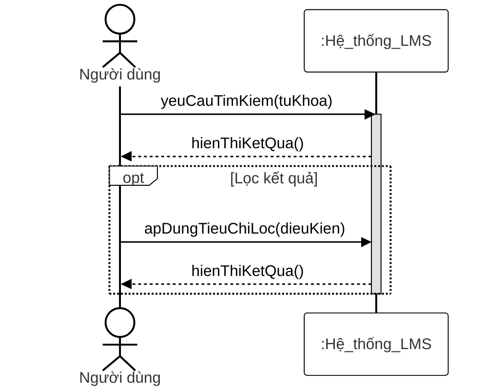

```mermaid
%%{init: { 'theme': 'base', 'themeVariables': { 'primaryColor': '#ffffff', 'primaryBorderColor': '#000000', 'lineColor': '#000000', 'textColor': '#000000', 'actorBkg': '#ffffff', 'actorBorder': '#000000', 'signalColor': '#000000', 'signalTextColor': '#000000', 'activationBorderColor': '#000000', 'activationBkgColor': '#e0e0e0', 'noteBkgColor': '#ffffff', 'noteBorderColor': '#000000' } } }%%
sequenceDiagram
    actor U as Người dùng
    participant Sys as :Hệ_thống_LMS

    %% Luồng chính: Bắt đầu Tìm kiếm
    U->>Sys: yeuCauTimKiem(tuKhoa)
    activate Sys
    
    %% Luồng Include: Hiện thị kết quả lần 1 (Chỉ có từ khóa)
    Sys-->>U: hienThiKetQua()
    
    %% Luồng Extend: Lọc kết quả (Kéo dài quá trình tìm kiếm)
    opt Lọc kết quả
        U->>Sys: apDungTieuChiLoc(dieuKien)
        
        %% Việc lọc vẫn nằm trong luồng Tìm kiếm, nên tiếp tục gọi Include "Hiện thị kết quả"
        Sys-->>U: hienThiKetQua()
    end
    deactivate Sys
```
